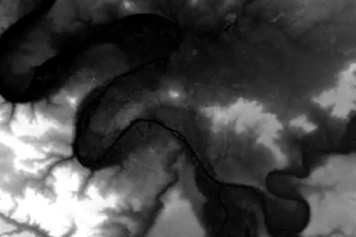
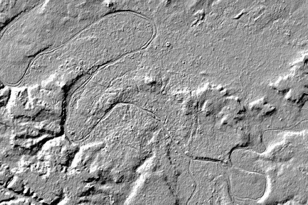
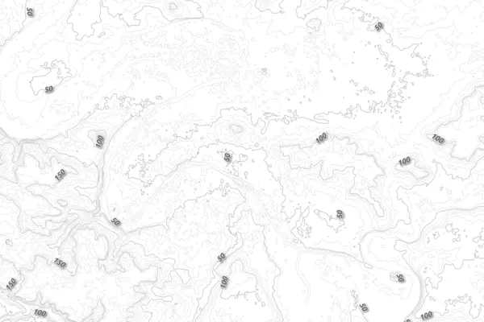

+++
date = 2016-09-06
title = "Altitudes"
+++

Vouloir représenter des altitudes sur une carte est plutôt courant.

J’explique ici comment créer de toutes pièces une carte représentant les
élévations.

Je voudrais avoir un fond de carte pour mieux représenter les altitudes de
Paris, à l’échelle d’un cycliste. Les fonds de cartes à l’échelle de France
avec des altitudes allant jusqu’à presque 5000 mètres ne nous intéressent pas.

On voudrait exagérer le relief entre 30 et 130 mètres pour pouvoir se rendre compte
d’un faux plat tel que sur la rue de la République.

# Source de données

Les altitudes sont généralement obtenues par des satellites ou pour des mesures plus
précises par avion.

Il existe des bases mondiales telles que l’américaine [STRM](https://fr.wikipedia.org/wiki/Shuttle_Radar_Topography_Mission) ou la japonaise
[ASTER](https://en.wikipedia.org/wiki/Advanced_Spaceborne_Thermal_Emission_and_Reflection_Radiometer#ASTER_Global_Digital_Elevation_Model).
Ces deux bases donnent l’altitude d’un point environ tous les 30 mètres.

En France, l’IGN a met à disposition des données ouvertes dans la base
[BD ALTI](http://professionnels.ign.fr/bdalti). La précision est d’un
point tous les 75m. Elle n’a donc strictement aucun intérêt par rapport aux
bases mondiales. Il existe aussi la [RGE ALTI](http://professionnels.ign.fr/rgealti) de l’IGN avec une précision
remarquable de 5 mètres, mais je n’ai jamais eu l’occasion de l’essayer
tellement les prix sont prohibitifs.

L’Europe fournit les données avec un pas de 25m en se basant sur les données
STRM et ASTER. Elles sont librement téléchargeable sur le site de
[EU-DEM](http://www.eea.europa.eu/data-and-maps/data/eu-dem). Ce sont
ces données qui vont être utilisées.

# Récupérer le bon fichier

Nous voulons un rectangle autour de Paris. Le coin nord-ouest est aux
coordonnées `(lon ; lat)` `(2,1 ; 49,0)` et coin sud-est `(2,6 ; 48,7)`.

Les données de EU-DEM sont dans le système de projection [EPSG:3035](https://en.wikipedia.org/wiki/European_grid). Une unité dans
cette projection correspond à un mètre. Chaque fichier représente un
carré de 1000km de côté, dont le centre est indiqué dans le nom du fichier.

Pour convertir mes coordonnées sphériques vers cette projection, j’utilise [GDAL](http://www.gdal.org/) :

```sh
echo -e "2.1 49.0 \n 2.6 48.7" | gdaltransform -s_srs EPSG:4326 -t_SRS EPSG:3035

3744051.46720138 2907303.46758626 0
3777142.88025981 2870291.83692777 0
```

On en déduit qu’il faut le fichier `EUD_CP-DEMS_3500025000-AA.tif`.

La commande `gdalinfo EUD_CP-DEMS_3500025000-AA.tifgdalinfo EUD_CP-DEMS_3500025000-AA.tif` permet d’avoir plus d’informations.

D’une part on y découvre que le fichier contient le système de projection
utilisé et qu’il s’agit d’une image carrée de 4000×4000 pixels, et que
chaque pixel représente 25 mètres.

Au lieu de représenter une couleur, un pixel représente une altitude.

Pour éviter de manipuler un fichier de 4Go, et donc de risque de se
retrouver un peu à l’étroit en mémoire vive, nous découpons le fichier
autour des coordonnées qui nous intéressent :

`gdalwarp -te 3744051 2870291 3777142 2907303 EUD_CP-DEMS_3500025000-AA.tif paris.tif`

# Mapzen terrain tiles

Il existe également une méthode bien plus simple pour récupérer le `tif` sur la
zone que vous voulez.

Il suffit d’utiliser le service proposé par Mapzen : https://mapzen.com/documentation/terrain-tiles/build-a-map/#desktop.

Merci à Thomas Gratier de me l’avoir signalé.

# Jouons avec QGIS

QGis est très à l’aise avec ce type de fichiers. Importons-le dans un
projet vierge comme [couche raster](http://hub.qgis.org/projects/quantum-gis/wiki/Opening_raster_files).

On obtient une image en niveau de gris, et on reconnait la Seine et ses
boucles, la Marne et d’autres affluents :



### Des couleurs !

On va modifier le style de la couche pour en faire quelque chose de plus sympathique.

En choississant un type de rendu `Singleband pseudocolor`, puis en choississant
le color map `Reds` suivi d’un clic sur `Classify` on obtient une proposition
pour un gradient de rouges pour représenter environ 100 m d’écart.

Le résultat est un peu décevant :


## Des ombres

Ce qu’il nous manque, c’est des _hillshade_ ou des ombres pour souligner le
relief. Ici intervient à nouveau `gdal` avec son outil `gdaldem` :

`gdaldem hillshade paris.tif paris_ombres.tif`.

Il est également possible d’utiliser `gdaldem` directement depuis QGis
au travers du menu `Raster>Analysis>DEM (Terrain Models)`.

Le résultat est finalement plus proche de ce qu’on imagine :



## Combinons les deux

Nous choisissons la fusion des deux couches (_blending_) avec le mode
_multiply_ pour obtenir l’image suivante :


## Courbes de niveau

Les courbes de niveau parlent particulièrement à certains habitués des
cartes. Nous générons une courbe tous les 10 mètres avec :

```sh
gdal_contour -a altitude -i 10.0 paris.tif iso10.shp
```

ou au travers du menu `Raster>Extraction>Contour`.

Le résultat n’est plus un fichier _raster_, mais un fichier vectoriel au
formate _shapefile_.

En répétant l’opération pour obtenir les courbes tous les 50 mètres,
puis en jouant avec les styles dans QGis, il est possible d’obtenir le
rendu suivant :



Pour une utilisation ultérieure, nous convertissons les fichiers
_shapefile_ en _GeoJSON_ dont les coordonnées seront en `(lon ; lat)`
(dont l’identifiant est 4326) et
non plus dans la projection originale des données altimétriques :

```sh
 ogr2ogr -t_srs EPSG:4326 -f geojson iso10.geojson iso10.shp
```

## Utilisation web

Si le but était de créer une carte papier, le composeur de QGis serait
tout à fait indiqué.

Cependant, si on désire faire une carte interactive pour le web, il faut
transformer les images en tuiles, ici en utilisant `gdal2tiles` afin d’avoir
des images de taille différente selon le niveau de zoom.

```sh
gdal2tiles.py --zoom=9-14 --s_srs EPSG:3035 paris_tout.tif
```

Ensuite utilisez votre outil carto préféré.
