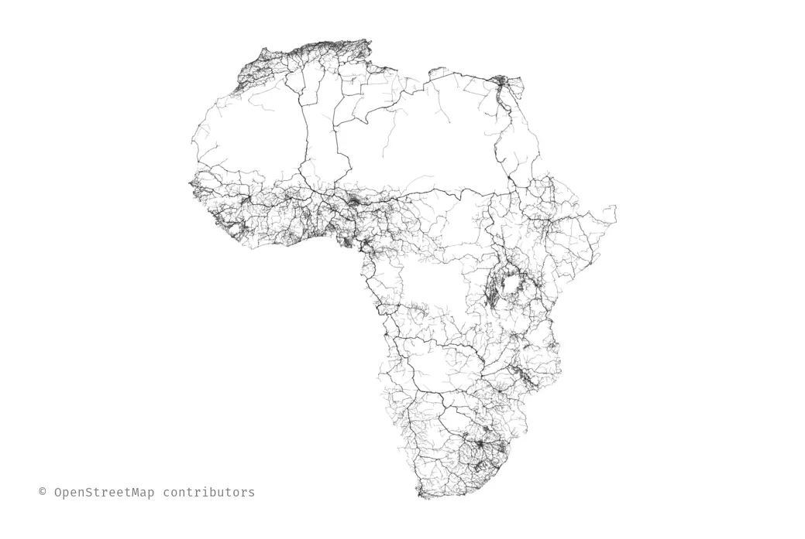
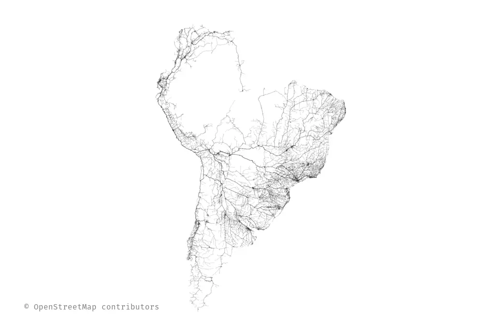
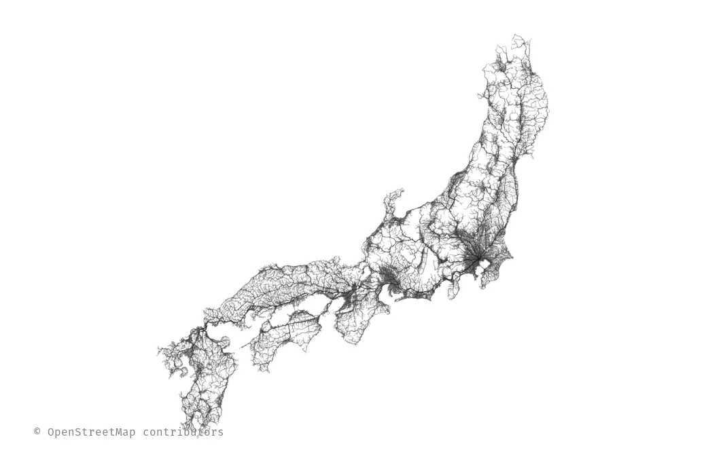

+++
date = 2016-12-06
title = "Toutes les routes depuis…"
+++

Il y a quasiment un an, j’avais copié le projet
[Roads to Rome](http://roadstorome.moovellab.com/) et décrit sur
[mon blog personnel](http://blog.tristramg.eu/roads-from-notre-dame.html) le processus.

Celui-ci était particulièrement pénible et pas vraiment réutilisable.

Il était temps de faciliter la génération des données et de permettre à tout le monde
de faire ses propres cartes.

Quelques exemples de cartes sont visibles sur [mon compte flickr](https://www.flickr.com/photos/tristramg/albums/72157672219472853).

## osm4routing en rust

Il s’agit d’un projet [très vieux](https://github.com/Tristramg/osm4routing/commit/cb0da48b02258ebb26a88a382761ff53d55412cf)
dont l’ambition est de permettre d’avoir un graphe dans un format très simple pour faire
du calcul d’itinéraire tel qu’il est enseigné en théorie des graphes à partir de
données réelle issues de [OpenStreetMap](https://www.openstreetmap.org).

L’ambition est clairement pédagogique, puisque un calcul d’itinéraire réel nécessite
beaucoup plus d’informations comme par exemple un modèle plus fin de la vitesse sur chaque tronçon,
les feux ou encore les interdictions de tourner.

Alors qu’il s’agissait initialement que d’un outil pour ma thèse, plusieurs personnes
semblaient s’en servir malgré les nombreuses limitations.

Parmi les limitations notables de ce projet :

* L’installation difficile étant écrit en C++ et python ;
* OpenStreetMap est passé à format de données bien [plus performant](https://wiki.openstreetmap.org/wiki/PBF_Format) ;
* Pas de tests et des petits bugs agaçants pourtant faciles à tester ;
* N’est pas utilisable comme bibliothèque.

Pour toutes ces raisons, et aussi pour avoir un prétexte d’écrire en [Rust](https://www.rust-lang.org/),
j’ai écrit une [nouvelle version](https://github.com/Tristramg/osm4routing2) corrigeant ces défauts.

## Roads from Notre-Dame

Une fois _osm4routing_ réécrit, j’ai pu réécrire le projet en le simplifiant considérablement :

* Un seul exécutable qui fait tout ;
* Plus de phase d’extraction du réseau routier ;
* Pas de dépendance à Postgresql et PostGIS ;
* Algorithme de Dijkstra au lieu de Bellman-Ford ;
* Pas de valeurs écrites en dur.

Si vous souhaitez créer votre propre carte, voici les étapes :

* Installez Rust : https://www.rust-lang.org/en-US/downloads.html ;
* `cargo install roads-from-nd` ;
* Trouvez l’[identifiant OpenStreetMap d’une intersection](https://www.openstreetmap.org/node/677151951) qui sera le point de départ ;
* Téléchargez la base OpenStreetMap de la zone qui vous intéresse à partir de http://download.geofabrik.de/. Comptez au moins autant de mémoire vive que la taille du fichier ;
* `roads-from-nd fichier.osm.pbf id_nœud_de_départ résultat.pdf`.

Si vous diffusez l’image générée, n’oubliez pas d’attribuer le droit d’auteur
aux [contributeurs OpenStreetMap](https://www.openstreetmap.org/copyright).

