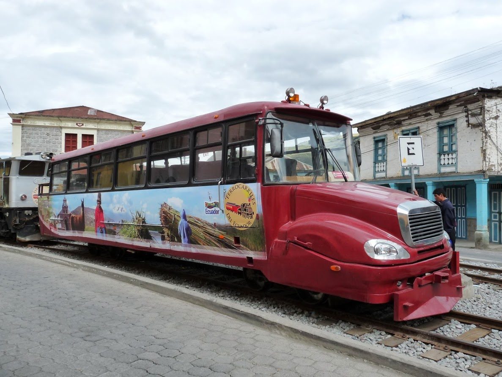
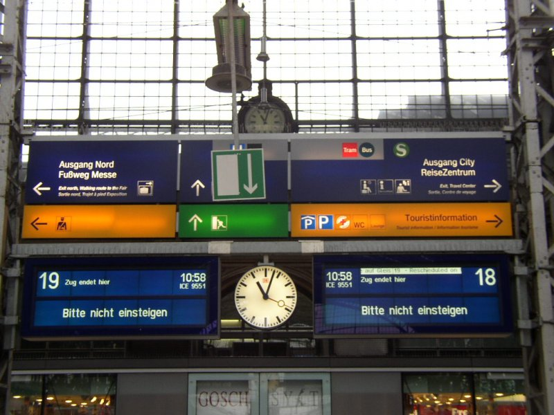

C’est quoi un train ?
=====================

:date: 2014-08-28 23:20
:tags: train, ecologie
:category: ecolo
:author: Tristram Gräbener
:status: draft

Normalement vous levez un sourcil et vous vous demandez dans quel troll je vous embarque.

La response n’est pas si triviale qu’elle en a l’air. Petit exposé des différentes façons de
voir un train à partir de mon expérience chez `Canal TP <http://www.canaltp.fr>`_ et
`Capitaine Train <https://www.capitainetrain.com>`_.

C’est un véhicule
-----------------

Les plus obtus me répondront que c’est bien évidemment ceci :

.. figure:: images/trains/talgo.jpg

 Le premier modèle de `Talgo <https://fr.wikipedia.org/wiki/Talgo>`_, un fabriquant espagnol à connaitre et à aimer

ou encore ceci

 Un *autoferro* en Équateur qui emmène des touristes sur `La Nariz del Diablo <https://fr.wikipedia.org/wiki/La_Nariz_del_Diablo>`_

Vous pensez donc au véhicule qui roule sur des rails (ou presque, ne chippotons pas sur la définition de rail ; c’est déjà assez bien compliqué).

.. figure:: images/trains/transrapid.jpg

 Le `Transrapid de Shanghai <https://fr.wikipedia.org/wiki/Transrapid_de_Shanghai>`_, premier train à sustentation magnétique en service commercial
 conçu en Allemagne par Siemens

Un identifiant de trajet
------------------------

Le Train `9551` qui quitte Paris à 7h06 pour arriver à Frankfort à 10h58 ne veut pas dire que c’est toujours la même rame ICE3 qui fait le trajet.
Ce sont même parfois des TGV Duplexe qui les remplacent.

 … et parfois ce train arrive sur deux quais en même temps…

Un train est donc l’identifiant d’un trajet régulier entre deux villes.

Un identifiant de locomotive
----------------------------

Parfois les rames se font des bisous

.. figure:: images/trains/jumeau.jpg

  Deux ICE3, l’un appartement là Deutsche Bahn, l’autre aux chemins de fer néerlandais

Dans ce cas les trains ont deux numéros de trains, même si le train ne se sépare pas.
